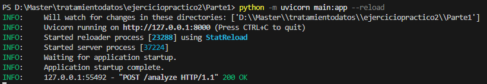
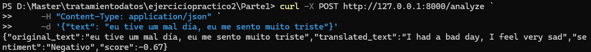
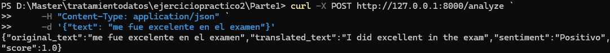
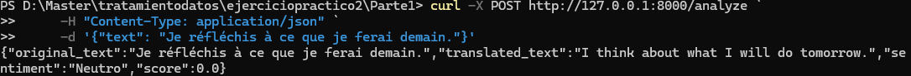

AI Linguistic Analyzer (FastAPI + NLP)
Este proyecto consiste en el diseño, desarrollo y pruebas de una API de Inteligencia Lingüística capaz de realizar análisis de sentimientos en múltiples idiomas, aplicando un pipeline de procesamiento de datos que incluye traducción automática en tiempo real.

1. Objetivo del Proyecto
Construir una herramienta funcional bajo el framework FastAPI que permita categorizar entradas de texto como Positivas, Negativas o Neutras, superando las limitaciones lingüísticas de las librerías estándar mediante la integración de servicios de traducción.

2. Tecnologías y Librerías

Lenguaje: Python 3.9+

Framework: FastAPI (Construcción de endpoints)

NLP: TextBlob (Procesamiento de lenguaje natural y cálculo de polaridad)

Traducción: Deep-Translator (Integración con Google Translate API, se utiliza ya que el API esta optimizada para idioma inglés, con esta API de traducción, independiente del idioma en que se haga la consulta, primero lo traducirá a inglés)

Servidor ASGI: Uvicorn

Validación: CURL

3. Control de Versiones (GitHub)

Se utilizó Git para la gestión del código siguiendo el flujo de trabajo:

Rama principal (main): Código listo para producción.

Rama de funcionalidad (feature/nlp-translation): Desarrollo del pipeline de traducción y lógica de sentimientos.

Comando de Merge:
git checkout main
git merge feature/nlp-translation

4. Instalación y Ejecución Local

Clonar el repositorio:

Bash #

git clone https://github.com/jcsp1687/uide-tratamientodatos-ej2-1

cd D:\Master\tratamientodatos\ejerciciopractico2\Parte1

Instalar dependencias:

Bash #

pip install fastapi uvicorn textblob deep-translator

Correr la API:

Bash #

python -m uvicorn main:app --reload

5. Procesamiento de Datos

La API no se limita a un análisis léxico básico. Se implementó una Solución Tecnológica avanzada:

Normalización Lingüística: La API detecta si el texto está en otro idioma y lo traduce al inglés internamente. Esto es crítico porque los diccionarios de polaridad de TextBlob son más precisos en inglés.

Cálculo de Polaridad: Se analiza el sentiment.polarity, donde valores cercanos a -1 son negativos y cercanos a 1 son positivos.

Manejo de Errores: Validación de strings vacíos y excepciones en el servicio de traducción.

6. Evidencias de Funcionamiento

A. API Corriendo Localmente

B. Prueba de Análisis 

Caso 1: "eu tive um mal día, eu me sento muito triste"

Resultado: Negativo

Caso 2: "me fue excelente en el examen"

Resultado: Positivo

Caso 3: "Je réfléchis à ce que je ferai demain"

Resultado: Neutro

7. Seguridad y Buenas Prácticas
Tipado Estricto: Uso de modelos Pydantic para asegurar que la data de entrada sea válida.
Principio de Responsabilidad Única: Separación de la lógica de traducción y la lógica de negocio de la API.